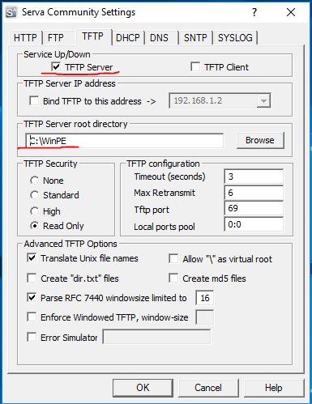
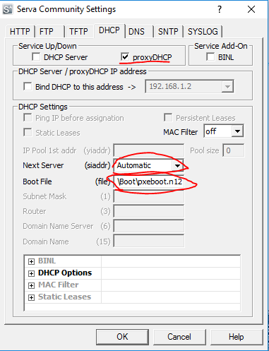

# Guest preparation
The preparation of the Guest image requires to first prepare a custom image of WinPE, which will be booted via TFTP from a PXE environment.
The entire process is summarized as follows:
- Preparing the WinPE image to be booted
- Configuring a TFTP server / DHCP proxy for TFTP boot
- Installing the OS on the Sandbox
- Installing the GuestAgent bootstrapper and other software dependency

For sake of simplicity we will install both iSCSI and TFTP/DHCP proxy on the same node where the HostController resides (i.e. __Tier 1__). The sandbox to be configured and the HostController live on the same LAN, where a classic gateway/dhcp server exists.

## Preparing a WinPe bootable disk
This section of the tutorial shows how to create a WinPE version of Windows 7 32 bit, to be booted over iSCSI. Part of the tutorial has been taken from the excelent [Etherboot project](http://etherboot.org/wiki/sanboot/win2k8_iscsi_install).

### WinPE installation
From within __Tier 1__ download and install the [Windows Automated Installation Kit](https://www.microsoft.com/en-us/download/details.aspx?id=5753).
Note that the Windows Automated Installation Kit depends on .NET 2.0, which is not installed on Windows Server 2012 by default.
To install .NET 2.0, open the Server Manger. Form the _Manage_ menu select _Install Roles and Features_. Follow the wizard until the _Features_ tab is selected. Then Select the _.NET Framework 3.5 Features_ and click _Next>_. This operation requires a reboot, so the system must be restarted before continuing this tutorial.
  
Once the AIK has been installed, open a command prompt as amdministrator and cd into the WinPE Tools, located at _c:\program files\Windows AIK\Tools\PETools\_

### Preparation of boot folder
The next step consists in creating the directory where to customize the WinPE image, then we copy necessaryu files into it.

```
C:\> mkdir C:\WinPE
C:\> call copype.cmd x86 C:\WinPE\Boot
C:\> del /Q etfsboot.com
C:\> move ISO\boot\boot.sdi boot.sdi
C:\> rmdir /S /Q ISO
C:\> imagex /mount winpe.wim 1 mount
C:\> copy mount\Windows\Boot\PXE\pxeboot.n12 pxeboot.n12
C:\> copy mount\Windows\Boot\PXE\bootmgr.exe bootmgr.exe
C:\> copy mount\Windows\System32\bcdedit.exe bcdedit.exe
C:\> imagex /unmount mount
C:\> rmdir /Q mount
C:\> bcdedit -createstore BCD
C:\> set BCDEDIT=bcdedit -store BCD
C:\> %BCDEDIT% -create {ramdiskoptions} -d "Ramdisk options"
C:\> %BCDEDIT% -set {ramdiskoptions} ramdisksdidevice boot
C:\> %BCDEDIT% -set {ramdiskoptions} ramdisksdipath \Boot\boot.sdi
C:\> for /f "tokens=3" %a in ('%BCDEDIT% -create -d "Windows PE" -application osloader') do set GUID=%a
C:\> %BCDEDIT% -set %GUID% systemroot \Windows
C:\> %BCDEDIT% -set %GUID% detecthal Yes
C:\> %BCDEDIT% -set %GUID% winpe Yes
C:\> %BCDEDIT% -set %GUID% osdevice ramdisk=[boot]\Boot\winpe.wim,{ramdiskoptions}
C:\> %BCDEDIT% -set %GUID% device ramdisk=[boot]\Boot\winpe.wim,{ramdiskoptions}
C:\> %BCDEDIT% -create {bootmgr} -d "Windows Boot Manager"
C:\> %BCDEDIT% -set {bootmgr} timeout 30
C:\> %BCDEDIT% -set {bootmgr} displayorder %GUID%
C:\> del /Q bcdedit.exe
```

At this point, we have prepared a basic WinPE bootable system, which can be booted from TFTP.

### Preparation of the TFTP/DHCP server
Expert users might rely on specific TFTP software packages or use directly TFTP/DHCP services offered by Windows Server.
For sake of simplicity, we suggest to use the excelent SERVA utility, freely [available for non commercial use here](https://www.vercot.com/~serva/download.html).

To begin, download and extract the 32bit community version of SERVA on the HostController node. Then, run it as administrator. After that, right click on its tray icon and select _Settings_.
Select the TFTP tab and enable the TFTP Server option. Then, specify the TFTP Server root directory so that it points to _C:\WinPE_.
This operation is equivalent to copying the Boot directory into the TFTP root.



The next step is to configure the DHCP server so that it correctly provides TFTP boot options.
Thus, select the DHCP tab. If there alredy is a DHCP server on the network (like in our case), Serva must be configured to operate as a DHCP proxy.
To do so, enable the _proxyDHCP_ option. 
On the contrary, if there is no DHCP server in the local lan, Serva will impersonate a full DHCP server.
In the latter case, the user should select _DHCP Server_ option.



Then, the user must set the _Boot File_ option so that it points to _\Boot\pxeboot.n12_ .
The _Next Server_ option should instead provide the IP address of the TFTP server. Serva automatically grabs its IP, so the user should leave this option to _Automatic_.

The user can now close the settings dialog. To apply the settings, restart Serva as Administrator.

### Preparing the iPXE boot image
Before starting the instllation of the Operating system on the Sandbox, the user needs to prepare a bootable USB stick/DVD rom for the iPXE environment.
To do so, simply download the latest version of iPXE [from here](http://boot.ipxe.org/ipxe.iso) and burn it on a DVD or flash it on an USB drive.

## Install the OS on the Sandbox
At this point the user is ready to proceed with the iSCSI boot and Windows installation via WinPE.
The first step is to boot the Sandbox via an iPXE USB stick/DVD disk previously prepared. 
Ensure the Sandbox has no physical disk installed and make sure its network interface is correctly connected to the same LAN where the HostController resides.
Then boot the Sandbox and enter its BIOS configuration tool (usually pressing F2 or CANC). Configure the boot order in such a way that the iPXE USB stick / DVD rom has maximum priority.
After that, save and reboot the system.
   
At this stage, the system should start loading the iPXE environment. When prompted, press CTRL+B to enter the iPXE shell.
Once the PXE environment is ready, type the following instructions:

<!--
  Alternative method when BIOS fails over next boot device
dhcp net0
set keep-san 1
set skip-san-boot 1
sanhook --drive 0x80 iscsi:<ip_iscsi_target>::::<iqn_iscsi_target>:<target_name>
exit
-->

```
dhcp
set keep-san 1
sanhook --drive 0x80 iscsi:<IP_OF_ISCSI_SERVER>::::<IQN_ADDRESS>:basedisk
autoboot
```

Replace _IP_OF_ISCSI_SERVER_ with the ip address of the node where the iSCSI service has been configured (in our case it collides with the HostController). 
Also replace the _IQN_ADDRESS_ value with the one obtained in the previous step during iSCSI taret creation.

The windows PE environment should start loading files. It might take some time to complete the WinPE boot process, be patient.
Once booted into the WinPE environment, insert the Windows 7 installation disk into the DVD-ROM drive. Then, from the WinPE command prompt, cd into the dvd drive and run setup.exe

```
c:\> D:
d:\> setup.exe
```

The windows installation wizard should appear. At this point the operating system can be installed normally.

Windows installer will reboot a couple of times before installation is completed. When this happens, the system will
fail to continue the installation and the windows installation procedure will start over again. To fix this problem,
the user has to manually boot from iscsi after every reboot, until the installation is completed. Thus, when the system
reboot, the user has to boot into the iPXE enviroment and type the following two commands:

```
dhcp net0
sanboot --drive 0x80 iscsi:<IP_OF_ISCSI_SERVER>::::<IQN_ADDRESS>:basedisk
```

Replace _IP_OF_ISCSI_SERVER_ with the ip address of the node where the iSCSI service has been configured (in our case it collides with the HostController). 
Also replace the _IQN_ADDRESS_ value with the one obtained in the previous step during iSCSI taret creation.

Hopefully, the system will boot again and the installation will continue normally. Repeat this process until the 
installation is done and the system, is ready to be customized.

__Note__: When prompted to select an username and a password, make sure no password is configured. The system needs to autologon at boot without requiring any user's input.

__Note2__: After the installation of the operating system, the user can safely close Serva on the HostController and clean up the C:\WinPE directory. 
However, we suggest to keep such environment on the system in case new/different Sandbox nodes with different hardware need to be configured.

## Install and Configure the Sandbox
At this point, the user has configured a valid iSCSI bootable image. It is now time to install the Gust Agent bootstrapper and its software dependency.

#### System updates
At this stage the Guest is capable of surfing the Internet via its own virtual adapter (which is natted behind the network of the host).
Therefore, the user can now activate the operating system. If needed, the user can also update the system via Windows Update. Once the updates have been correctly installed, ww strongly advise to disable the automatic update feature.
Doing so, the system will not try to update the OS during the analysis. On the contrary, in case automatic updates are left enabled, there is a chance that they will trigger during the analysis, impacting on performance and potentially biasing sniffed network traffic.

Once the system has been correctly activated and updates have been performed, the user can then proceed with the installation of the GuestAgent bootstrapper.

#### Install .NET 4.0, VC Redist 2013 and VC Redist 2015
Before installing the GuestAgent Bootstrapper, the system must comply with some software package dependency.
In particular, the agents rely on both Visual Studio 2013/2015 Visual C++ redistributable packages and .NET 4.0.

Thus, download and install the 32bit version of the .NET framework from the Microsoft website. 
The correct version of the .NET framework can be [found here](https://www.microsoft.com/en-us/download/details.aspx?id=17718).

Then, do the same for the VC++ 2013 and VC++ 2015 Redistributable Packages. 
The VC++ 2013 32 bit version [is available here](http://download.microsoft.com/download/0/5/6/056dcda9-d667-4e27-8001-8a0c6971d6b1/vcredist_x86.exe).
The VC++ 2015 32 bit version [is available here](https://download.microsoft.com/download/6/A/A/6AA4EDFF-645B-48C5-81CC-ED5963AEAD48/vc_redist.x86.exe).

#### Install the GuestAgent Bootstrapper
From within the Virtual Machine, open a browser and dowload the precompiled installation package for the guest agent at [this URL](https://albertogeniola@bitbucket.org/aaltopuppaper/guestagents/raw/0594043ec791e95944487a3646c9994ebf045fd6/ClientBootstrapper/dist/agent_setup.exe). 

Then, execute the installation of the bootstrapper, by simply double clicking on it. Then, follow the wizard to complete the installation. The installer will take care of downloading the needed python environment, necessary dependencies and will also install the bootstrap autostart task.

To double check the bootstrapper installation, reboot the virtual machine. 
Just after Windows loads up, the bootstrapper program should automatically start, complaining about _no response from any sniffer_. 
If that is the case, the bootstrapper is correctly working. 
Now close the bootstrapper and shut down the virtual machine correctly.

#### User's defined customization (also applies for Linux Host preparation)
At this stage, the user might apply some specific customization to the image. For instance, he might want to install a new browser or some flash player plugin. 
He can also install common software usually available on desktop computers, such as Java runtime or Microsoft Office. 
If planning to analyze evasive binaries, the user should also surf the web and create fake social network accounts, so that cookies are left on the system.
In our tutorial we do not perform any of these operations.

#### Disable startup repair on unclean reboot
It might happen that a VM reboots unexpectedly. When this happens, Microsoft Windows OS tend to start the Startup Recovery process, which require human actions to be completed.
In our case, such recovery process cannot be applied, therefore we need to disable it.

To do so, open a command prompt as administrator and type the following command:

```
C:\> bcdedit /set {default} recoveryenabled No
```

## Finishing the Guest configuration
The Sandbox base image is now fully configured and ready to be used as analysis system. 
However, sandboxes will not use the base image directly. Instead, they will attach differential disks on the top of the base image, which are generated on demand by the HostController.
So, the Sandboxes need to "request" the creation of a new differential disk at every bootstrap before even loading the operating system.
To achieve this goal, we again rely on the excelent iPXE system. In practice, we will setup a cutom iPXE bootable USB/DVD rom containing a specific boot script. 
Such script basically performs an HTTP request to the HostController. In turn, the HostController will allocate a new differential VHDX disk on the top of the base disk, then will expose it via iSCSI and will return the iPXE instructions to boot from that image.

Thus, from within the HostController, open a browser and navigate to [https://rom-o-matic.eu](https://rom-o-matic.eu). Select the desired output format. If planning to leave a CD into the host, select _.ISO bootable image_ format. If planning to use a USB stick, select the _.USB_ format (please note that the CD/USB must remain plugged into the Sandbox, so act accordingly).
Then, into the _Embedded script_ box, put the following:

```
##!ipxe
:retry_dhcp
dhcp || goto retry_dhcp

:boot
echo Contacting preconfigured HTTP server for loading...
chain --timeout 180000 http://<IP_OF_HOSTCONTROLLER>:<PORT_OF_HOSTCTRL_ISCSI_SRV>/boot/${net0/mac} || goto retry_boot

:retry_boot
sleep 1
goto boot
```

Replace the place marker __<IP_OF_HOSTCONTROLLER>__ with the IP address of the HostController in the LAN and _<PORT_OF_HOSTCTRL_ISCSI_SRV>_ with the port of the service dispatching iSCSI scripts (default is 8181). 
Then, click _Proceed >>_ and download the ISO/USB image file. 

As last step, burn the image file into as many CD/DVD as many Sandboxes are in place (analogously use win32diskimager to flash the .USB image on usb sticks).

## Setup BIOS of Sandboxes
The very last step in configuring the Sandboxes consists in setting up their BIOS. The following configuration has to be performed on each bare metal machine being used in the analysis.
Since there are many different BIOS vendors and possible configuration, we do not specify detailed instructions on how to perform bios configuration.
On the contrary we will refer to them in general.

In the first place, BIOS must be configured to boot only from the DVD/USB stick previously prepared. So make sure there is only one boot option enabled.

Secondly, the BIOS should be configured to resume ON state on power loss. Such configuration will enable the sandbox to boot up when power is lost and regained (which is the way bare-metal machines are rebooted).
Such configuration is __crucial__ for the system to work correctly.

So, plug in the USB sticks or insert the CD/DVDs into each sandbox. Then make sure sandboxes have no hard disk installed and that the first boot option in the bios corresponds to the media just installed.


# ARDUINO REBOOT: TODO.

1. [Introduction](1_Introduction.md)
1. [Database and HostController installation](2_DB_and_HostController.md)
1. Guest installation
1. [Sniffer installation](4_Sniffer.md) (_next step_)
1. [HostController configuration](5_Configuration.md)
