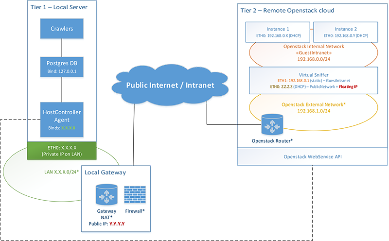

# Two tiers configuration, using Openstack.
A two tiers configuration uses two distinct nodes to implement the analysis infrastructure.
In particular, a local node will host the central database and the host controller, while a remote cloud infrastructure (i.e. Openstack) is in charge of running the sandboxes and the sniffers.

In contrast with the **Single tier** configuration, this one has the advantage of offloading the heavy virtualization task to a remote infrastructure (e.g. Openstackcloud).

In general, we do recommend this configuration if one or more of the following conditions are met:

- The user can leverage a powerful Openstack infrastructure (which might be remote or in his intranet)
- The numberof installers to be analyzed is great and throughput should be high
- The user trusts the remote cloud infrastructure

This tutorial will guide the user in the installation of Central Database, Host Controller and in the preparation of the sniffer instance to be used on the openstack cloud. Moreover, the user will learn how to deploy the infrastructure on an Openstack Cloud.

## Topology description
A two tiers topology consists in two nodes: a local node handling the central database together with the Host Agent, and a remote cloud infrastructure.
_Figure 1_ depicts the configuration goal of the two tiers topology that the user will deploy following this tutorial.

; Description of topology

; Host Controller with Public IP

; Openstack cloud with private NAT and Public Network

; Sniffer connected to public network via Floating IP

## What's next?
The entire tutorial is divided into 5 steps, to be followed in order:

1. Introduction
1. [Database and HostController installation](2_DB_and_HostController.md) (_next step_)
1. [Sniffer installation](3_Sniffer.md)
1. [Guest installation](4_Guest.md)
1. [HostController configuration](5_Configuration.md)

