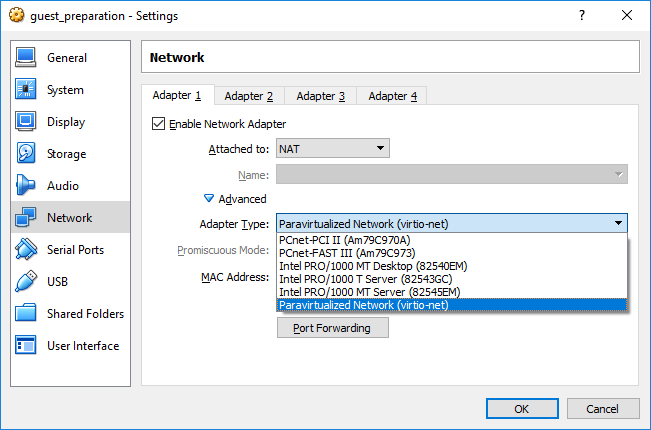
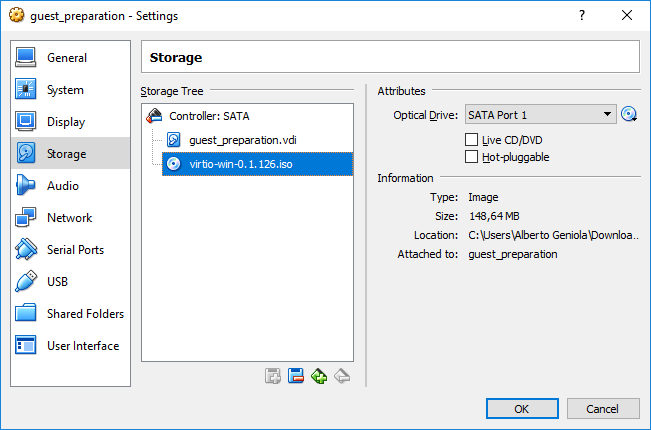
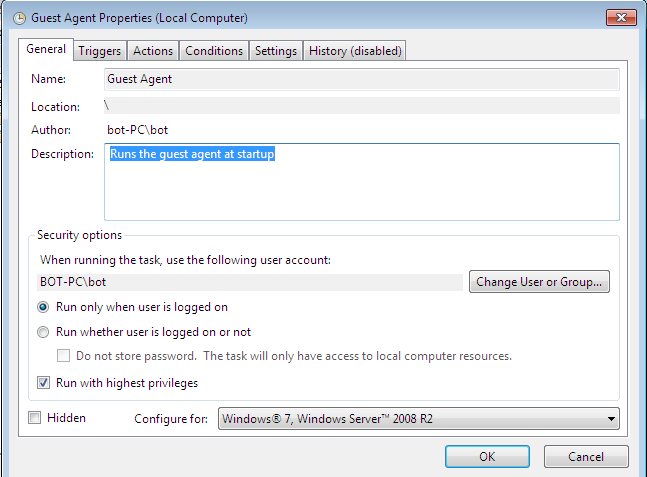
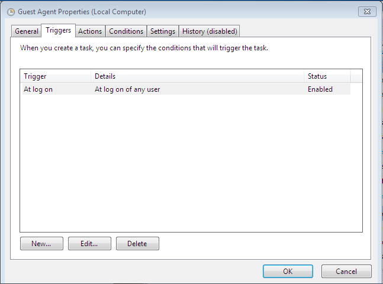
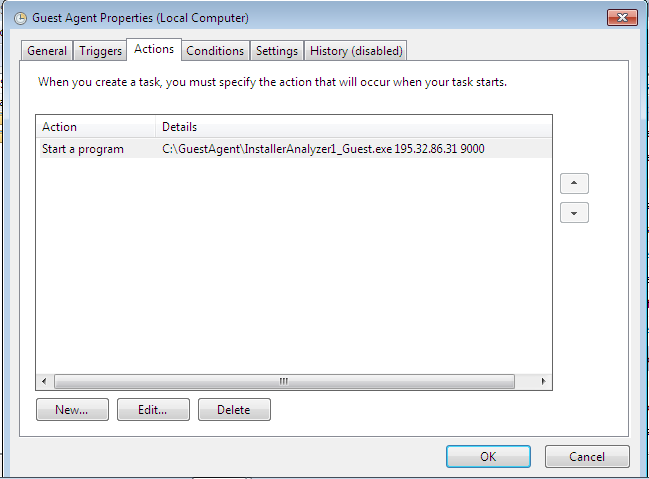

# Openstack Guest Preparation

Currently, TheThing only supports Windows 7 SP1 32bit guest operating system. In this tutorial, we will specifically refer to Windows 7 Professional 32bit SP1. Other versions of windows 7 should work the same, but have not been tested.
In this tutorial we will show how to configure guest machines to run on Openstack, e.g. how to prepare a VM image that will boot on Openstack cloud.
To summarize, here there are the steps to perform:

1. Create a virtual machine with Virtualbox/Qemu
1. Install a fresh Windows 7 32bit on the guest
1. Update Windows via Windows Update
1. Install software dependencies
1. Install virtio drivers
1. Install and configure GuestAgent
1. Verify everything is ok
1. Publish the image to the Image service (Glance)

## Create a VM
Lauch Virtualbox and create a new virtual machine named *guest_preparation*. Assign Windows 7 32 bit as target OS, with at least 2Gb of ram memory and a new dynamic allocated disk of at least 25 Gb. Save the disk image on the desktop, naming it as *guest_preparation.vdi*.
Edit the newly created machine: assign to it at least two vCPU and mount the windows 7 installation media in the CDROM drive. Also make sure CDROM is the first item in the boot order list. Then, make sure the VM has a single NIC with internet connection. For installation purpose, we advise to use NAT connection emulating an _Intel PRO/1000_ interface, natively supported by Windows 7.  

## Install and update Windows 7
Start the VM and perform a fresh Windows 7 installation. Stick with defaults provided by the installation wizard. Upon first boot, create a user named _bot_ and make sure it needs no password authentication to login. This will make Windows to automatically log-on at startup.
Then, activate windows and update the system (optional) via Windows Update. After all the updates have been installed, reboot the system and disable windows update. Disabling windows update will prevent guests from downloading and installing updates during the analysis.
We also suggest to install a newer version of Internet Explorer, since Windwos 7 SP1 comes with the old Internet Explorer 8.   

## Software dependencies
The Guest Agent depends on a number of software packages/libraries. The user needs to download and install the following, in order:
- Windows .NET 4.0 (available at: https://www.microsoft.com/en-gb/download/details.aspx?id=17718)
- Visual c++ runtime environment 2013 32bit (v. 12, available at: https://www.microsoft.com/en-gb/download/details.aspx?id=40784)
- Visual c++ runtime environment 2015 32bit (v. 14, available at: https://www.microsoft.com/en-gb/download/details.aspx?id=48145)

*Note*: Before taking this step, make sure all updates have been downloaded an installed on the system. Some of the dependencies might not work in case updates are not installed.

## Install virtio drivers
Guests running on Openstack require virt-io drivers to work under windows environment. Thus, the user has to install such drivers on the guest operating system. 

 

To do so, shut down the virtual machine. Once it is powered off, edit its networking configuration by changing the NIC type of the network adapter from _Intel PRO/1000_ to _Paravirtualized Network (virtio-net)_. Then download the virt-io drivers from here: https://fedorapeople.org/groups/virt/virtio-win/direct-downloads/stable-virtio/virtio-win.iso. Once downlaoded, mount that iso on the vm's cdrom and boot the VM again.
At boot time, the operating system should recognize the presence of a new driver and should start the driver installation wizard. Windows 7 will fail to install such drivers, so the user has to manually install them. To do so, open the "Device manager", navigate to the "Ethernet Controller" under "Other devices". Right click on it and select "update driver software". Then click on "Browse my computer for driver software". In the next dialog, sepcify the CDROM/DVDROM root path that contains the mounted image of virtio drivers (in our case D:\) and press "next". The System should now recognize and prompt to install the required driver.
Once done, reboot the system again and check if the system is still able to access the network. If that is the case, the driver has been installed correctly. Otherwise something went wrong during the installation, and the driver should be reinstalled again.

## Guest Agent installation
At this point, the system is ready for GuestAgent installation. To do so, download the GuestAgent binaries archive, GuestAgent.zip (from: _TODO_) extract its contents into a *C:\GuestAgent*.
The next step consists in making the GuestAgent to automatically run at startup. To do so, create a scheduled task named _Guest Agent Bootstrap_ and select "When I logon" as trigger. As action, specify "Start a program" and browse to _C:\GuestAgent\InstallerAnalyzer_Guest.exe_. In the "program's arguments" specify the public ip-address/hostname and port of the HostController. Eventually, specify the working directory where to start the program, which should be "C:\GuestAgent".
Once the automatic task has been created, edit it and make sure the option "_Run with highest privileges_" is checked. 

  

## Verify guest configuration
Before preparing the image, it is a good idea to verify that everything is working. In particular, the user has to make sure that:
- GuestAgent is installed and automatically starts up at boot
- Guest has access to the internet and is able to reach the HostController

A simple power-cycle of the vm should be enough to verify if most of the things are correctly working. In particular, if after a reboot the system automatically starts up the GuestController, and it tries to contact the HostController (without success, because it is still down), everything is working. Since the HostController hasn't been started yet, the Guest Controller will keep failing to connect. Don't warry about that, just force the Installer Analuzer process to shut down (using task manager) and shut down the system.

## Publish the image on Openstack cloud
Now that the guest preparation has completed, the user has to publish the image of the guest on the Openstack cloud. Before doing that, the user needs to convert the image into a RAW format, which will be then uploaded to the cloud.
Since the image has been prepared using VirtualBox, we will use the VBoxManage utility to convert the disk. 

```
VBoxManage clonehd path/to/prepared/guest/disk path/to/new/raw/disk --format raw
```

This process might take a while. Once done, we can now upload it to the Openstack cloud we plan to use. THe easiest way to do that is to use the Horizon web interface. In case command line tools are installed (and preferred), the user can issue the following command:

```
openstack image create --disk-format raw --container-format bare --public --file path/to/raw/image image_name
```