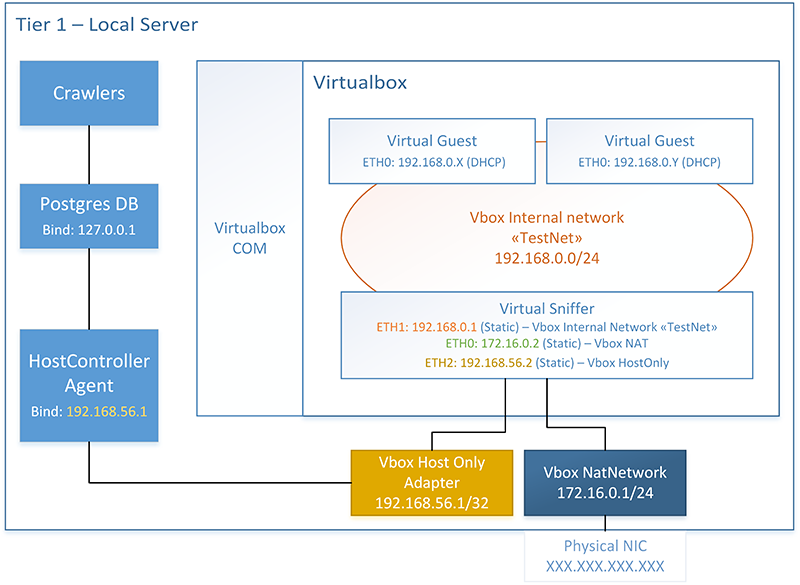

# Single tier configuration, using Virtualbox.
A single tier configuration consists in installing all the mandatory parts of the distributed system on a single hardware node. Obviously, such a configuration frustrates the advantages of a distributed system (scalability, robustness, etc.). On the other hand, it enables a simpler configuration scheme and simplifies some security issues affecting more complex topologies.

In general, we do recommend this configuration if one or more of the following conditions are met:
- This is the first time the user is experimenting the infrastructure.
- Only a single, robust and high-performance server can be used for deploying the infrastructure.
- Security is a must.
- The number of installers to be analyzed is small or analysis time can be long.

In this tutorial, the user will learn how to deploy the central DB, an HostController Agent and the Virtualbox virtualization system both on a Windows Server 2012 64bit operating system and Linux Ubuntu 16.04 LTS. Each one of the following sections is indeed splitted in two parts: the first one describes install instructions for Windows, while the second one regards Linux.

## Topology description
A single tier topology condensates all the mandatory modules of the infrastructure on a single hardware node. While such node can either be virtual or physical, we recommend using a physical server, dedicated to such infrastructure, so that maximum performance can be achieved.

The goal of this tutorial is to obtain the configuration showed in the following figure.

<!--  -->

<html>

 
<b>Figure 1</b>: Topology overview

<html>

The host node has three distinct network interfaces. The first one is its physical NIC, used as main adapter when accessing the network. This interface will bind an IP address, marked as XXX.XXX.XXX.XXX, depending on how the user's network is configured.

A second (virtual) network adapter, based on the Virtualbox Host Only driver, is installed on the Host. Such interface binds 192.168.56.1 and its goal is to enable local communication (within the host) between Host Controller Agent and the Virtual Sniffer. Therefore, the Host Controller Agent will explicitely bind 192.168.56.1 and ETH2 of Sniffer will bind 192.168.56.2.

A third network is emulated via the VirtualBox Nat Engine. Such network routes traffic incoming from the sniffer to the external internet, via NAT. 

The Virtual Sniffer acts as a gateway, by forwarding traffic from 192.168.0.0/24 to 172.16.0.1/24, which is in turn routed to the Internet via the physical NIC of the server. This configuration is pretty heavy and involves cascading NAT. Therefore it does not scale nor perform well. However, since all NIC use paravirtualized network, this configuration is still suitable for a small number of sandboxes and requires no networking hardware to be implemented. 

In the end, each sandbox has a single NIC, and use DHCP to acquire an IP address. The sniffer uses DNSMasq service to provide both DNS realy and DHCP services on 192.168.0.0/24.

## What's next?
The entire tutorial is divided into 5 steps, to be followed in order:

1. Introduction
1. [Database and HostController installation](2_DB_and_HostController.md) (_next step_)
1. [Sniffer installation](3_Sniffer.md)
1. [Guest installation](4_Guest.md)
1. [HostController configuration](5_Configuration.md)

