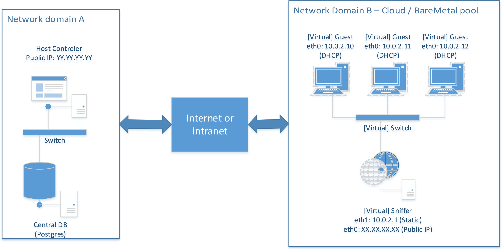
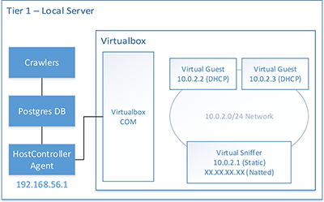
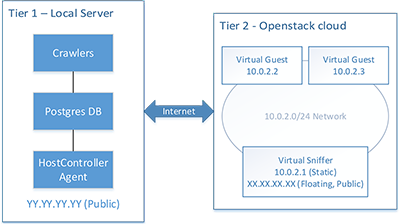

# TheThing: automated installer analyzer
TheThing is an automated sandbox analyzer developed precisely for analyzing PUP installers. As such, it has three main objectives:

- To click through the installation process, simulating a human user
- To monitor and collect information regarding system changes during installation process
- To store collected data into a database for later study

To achieve such goals, TheThing is implemented via a distributed architecture, composed by:

- Crawler(s) **(optional)**: collect jobs from the Internet and save them into the database
- A central database: stores jobs and results. Also stores some state for ongoing analysis, used internally by host controllers.
- Host controller(s): handles the life-cycle of guests via specific hypervisor API and perform some post-processing on collected data.
- Guest agent(s): represent machines used as Sandbox in which analysis happens. They can be either virtual or physical.
- Network sniffer(s): implement gateways for providing controller Internet access to guests. Controlled by host controllers, they are in charge of sniffing traffic flowing among guests.

Ideally, each part of TheThing runs on a distinct node, that can be either physical or virtual. However, the user may also opt for a single-node architecture, installing all the components on the same machine. To let the system scale, user should install central database and each host controller on distinct nodes hardware nodes. Obviously, the type and number of different components running on each hardware-node strongly depends on hardware capabilities of the underlying machine.

In order to support both virtual and bare metal guests, communication among nodes of the architecture is performed via standard TCP/IP socket. Therefore, any configuration of the system must comply with a specific network topology. Currently, TheThing supports the following network scheme.

Guests (sandboxes) are equipped with a single network interface (eth0), connected to a private network. On the same network there must be a sniffer instance, which acts as a gateway, providing basic DHCP/DNS/NAT capabilities to the guests. The sniffer is equipped with two network interfaces: eth0 is connected to external Internet, while eth1 is connected to the private network, binding a static IP address. Therefore, traffic from/to eth1 is routed to eth0, enabling guests to access the Internet via natting. 

# Important notes
Before going through installation and configuration of the infrastructure, it is really important to understand how TheThing works from an high perspective. More specifically, it is worth understanding which and how the nodes of the infrastructure communicate each others. 

## Central DB
The central database consists in the synchronization point of the entire infrastructure. It holds results, jobs and status of current analysis. 
In general, both crawlers and HostControllers need to communicate with the central database. Therefore, it is usually a good idea to condensate the DB instance, the HostController and the crawlers on a single physical server. By doing so, network communication between HostController and Database happens locally via the loopback interface. Nevertheless, such configuration enables a more secure setup of the infrastructure, because DB access can be limited exclusively to the loopback domain (127.0.0.1).

In general, the **DB must be reachable by crawlers and HostControllers**. When using multiple distributed HostController, the DB must allow incoming connection from IPs where HostControllers and crawlers are running. **We strongly recommend to not expose the DB on the Internet**, but connect HostControllers and DB via a private LAN (using a switch).

## HostController
A HostController is a service, running on a node, that is in charge of handling the life-cycle of sandboxes. To do so, it uses specific APIs, depending on the sandbox type it has to handle. For example, a HostController might use Openstack API for orchestrating the analysis of binaries via an Openstack cloud. Similarly, it can use Virtualbox API to do the same. Nevertheless, it can handle the life-cycle of bare-metal machines.

From network perspective, each **HostController must be able to communicate with the central DB and should be reachable by the sandboxes it administrates**. Ideally, it uses a private NIC (or a local socket) to communicate with the DB while listening on a public IP for requests incoming from GuestAgents.

## Guests
A guest is a sandbox, which can either be physical or virtual, in which binaries are executed. Current version of this infrastructure only supports Windows 7 SP1 32 bit operating system. Guests' life-cycle is handled by a HostController. That means that the HostController decides when to spawn a Guest and what jobs the guest should be assigned.

Guests are configured in such a way that a specific software module, the GuestAgent, runs at startup. That software module is in charge of retrieving the binary to analyze, automate its installation and collect resource accesses performed by the binary during its analysis. All this information is stored locally and then transmitted back to the HostController. 

From the networking perspective, the GuestAgent needs to connect to a specific HostController, via a TCP connection on port 9000 (by default). This means that the **HostController must be reachable by guests**. The easiest way to ensure such a requirement is to publish the HostController over the Internet, binding a public IP. _Other approaches are possible_, but we don't discuss them here.

## Sniffer
A sniffer is a virtual or physical entity that provides basic network services to a number of guests, while implementing sniffing capabilities. Sniffers are controlled by HostController via a web-service interface. This essentially means that HostControllers should be able to communicate with sniffers via a web interface. Again, the most compatible (and also most insecure) way of providing such capability is to assign the sniffer a public IP.

## Prerequisites
Each type of node has different prerequisites.

- HostController: developed in Python, can be installed on Linux or Windows hosts (Linux 14.04 LTS and Windows Server 2012 have been tested). It requires Python 2.7 to be installed on the system.
- Central Database: can be one of the technologies supported by SqlAlchemy. We recommend to use PostgreSql, since it is the only dbms we tested.
- Crawlers: developed in Python, can be installed on Linux or Windows hosts. We do recommend to install it alongside one of the HostController instances.
- Guest: only Windows 7 SP1 operating systems are supported.
- Sniffer: currently is implemented as a software router on the top of a standard Linux distribution (Ubuntu Server 14.04 LTS). Requires at least two network interfaces.

All the nodes of the infrastructure can either be physical or virtual, depending on the user's specific needs. 

# Installation
Being a distributed system, the deployment of TheThing is quite time consuming. Moreover, TheThing might be configured in a number of ways, depending on the specific sandbox system used (hypervisor/baremetal). In this document we provide two distinct tutorials for deploying the thing: a single tier configuration using VirtualBox as hypervisor and a two-tiers configuration using a remote Openstack cloud infrastructure. Both of them are briefly described below.

## Single-tier configuration, using VirtualBox

This is the easiest configuration possible, recommended for first time users. It only requires a single node to work and implements all networking communication locally. In fact, all the components of the infrastructure are deployed on a single node. The virtualization system used for this purpose is VirtualBox. 

Although the 1-tier configuration is the easiest to start from, it cannot scale. We suggest to start using this configuration and once confident, move to a more scalable configuration.

[**Installation and Deployment instructions for such topology are available HERE**](Docs/Virtualbox/1_Introduction.md).
## Two-tiers configuration, using Openstack

The two tiers configuration uses a node for hosting the database, the crawlers and a HostController. In this specific case, Openstack cloud is used as virtualization option. Such configuration enables better scalability, in accordance with resources available on the specific Openstack cloud. 

[**Installation and Deployment instructions for such topology are available HERE**](Docs/Openstack/1_Introduction.md).

## Baremetal, [todo]

**Installation and Deployment instructions for such topology are available HERE**.

## Mixed multitier, [todo]

**Installation and Deployment instructions for such topology are available HERE**.